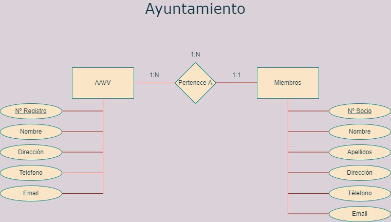

# 1.1 Ejercicio 1. Asociaciones
**El ayuntamiento de tu localidad quiere almacenar información de las asociaciones de vecinos de la
ciudad y de los miembros que componen cada una de ellas. Cada socio recibirá un número de socio
que le identicará en la asociación a la que pertenece y cada asociación tene un número de registro
suministrado por el ayuntamiento al darse de alta. Crea el modelo E/R (incluyendo los atributos que
consideres oportunos) necesario para representar dicha información.**

* Entidad AAVV
  * <u>Número de registro</u>
  * Nombre
  * Dirección
  * Teléfono
  * Email
  
* Entidad miembros
  * <u>Número de socio</u>
  * Nombre
  * Apellidos
  * Dirección
  * Teléfono
  * Email

